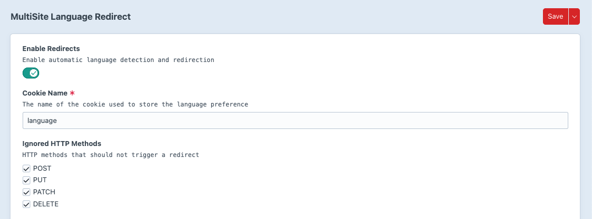
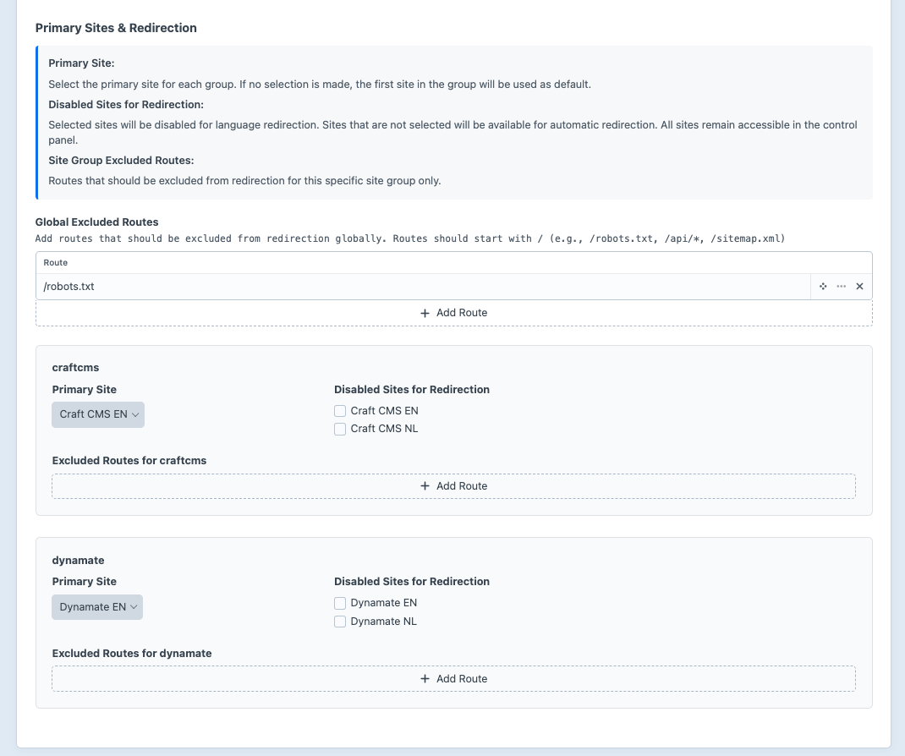

# MultiSite Language Redirect

automatically redirects users to the appropriate site in a Craft CMS multisite setup based on their browser language or previously selected language.

## Requirements

This plugin requires Craft CMS 5.0.0 or later, and PHP 8.2 or later.

## Installation

You can install this plugin from the Plugin Store or with Composer.

#### From the Plugin Store

Go to the Plugin Store in your project's Control Panel and search for "MultiSite Language Redirect". Then press "Install".

#### With Composer

Open your terminal and run the following commands:

```bash
# go to the project directory
cd /path/to/my-project.test

# tell Composer to load the plugin
composer require esign/craft-multi-site-language-redirect

# tell Craft to install the plugin
./craft plugin/install multi-site-language-redirect
```

## Configuration

### Route Exclusions

You can exclude specific routes from language redirection in two ways:

#### Global Excluded Routes
Routes that should be excluded across all site groups. These are useful for system routes like `/robots.txt` or API endpoints.

#### Site Group Specific Excluded Routes
Routes that should be excluded only for specific site groups. This allows for more granular control when different site groups have different requirements.

#### Wildcard Support
Both global and site group specific exclusions support wildcard matching using `*`:
- `/api/*` - Excludes all routes starting with `/api/`
- `/special-*` - Excludes routes like `/special-page`, `/special-content`, etc.

#### Configuration via Settings
Configure route exclusions through the plugin settings in the Craft CMS control panel under Settings → Plugins → MultiSite Language Redirect.

#### Configuration via Config File
For advanced configuration, you can also manage plugin settings through a config file. Create `config/multi-site-language-redirect.php` in your Craft project and copy the settings from the [example configuration file](src/config.php).

## License

The MIT License (MIT). Please see [License File](LICENSE.md) for more information.

### Screenshot

